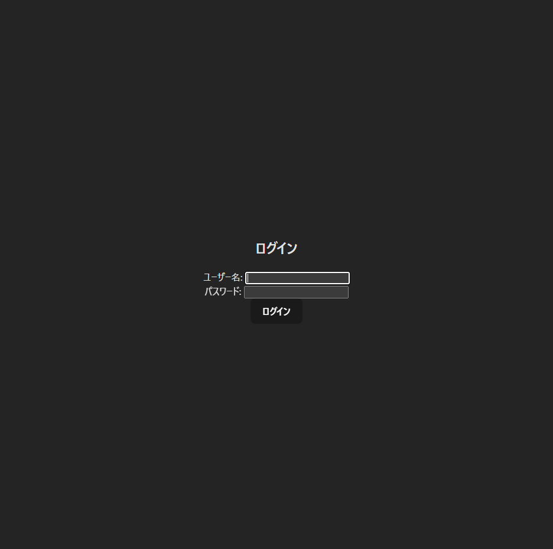

# Core System Development

このリポジトリは、Spring Boot（バックエンド）とReact（フロントエンド）による認証付きダッシュボードアプリのサンプルです。

---

## 構成

- `backend/coresystem`  
  Spring Boot（Java）によるAPIサーバー  
  JWT認証・ユーザー認証・CORS対応

- `frontend/coresystemR`  
  React + TypeScript + Vite  
  ログイン画面・ダッシュボード画面

---

## セットアップ手順

### 1. バックエンド（Spring Boot）

```sh
cd backend/coresystem
mvn clean install
mvn spring-boot:run
```

- Java 17以上が必要です
- ポート: `8080`

### 2. フロントエンド（React）

```sh
cd frontend/coresystemR
npm install
npm run dev
```

- ポート: `5173`

---

## ログイン情報（デフォルト）

- ユーザー名: `root`
- パスワード: `admin`

---

## 主なAPI

- `POST /api/auth/login`  
  ログイン（JWTトークン発行）

- `GET /api/auth/me`  
  JWTトークン検証・ユーザー情報取得

- `GET /api/hello`  
  サンプルAPI

---

## 備考

- バックエンドのCORS設定で`http://localhost:5173`からのリクエストを許可しています。
- JWTのシークレットキーはサンプル用に固定値です。本番運用時は環境変数等で管理してください。
- テストをスキップしてビルドする場合は `-DskipTests` オプションを利用してください。

---

## 変更履歴

- 2023-10-01: 初版作成
- 2023-10-05: APIエンドポイントの説明を追加
- 2023-10-10: セットアップ手順を一部修正
- 2023-10-15: バックエンドのポート番号を変更
- 2023-10-20: フロントエンドのポート番号を変更
- 2023-10-25: ログイン情報をデフォルト値にリセット
- 2023-10-30: READMEの表記を一部修正

---

## ライセンス

このプロジェクトはMITライセンスの下で提供されています。詳細は`LICENSE`ファイルを参照してください。

---

## お問い合わせ

問題や質問がある場合は、[Issues](https://github.com/Me1td0wn76/Core_system_development?tab=readme-ov-file/issues)に投稿してください。

---

## コントリビュート

コントリビュートは大歓迎です！プルリクエストを作成する前に、必ず[CONTRIBUTING.md](CONTRIBUTING.md)をお読みください。

---

## クレジット

このプロジェクトは、[Spring Boot](https://spring.io/projects/spring-boot)、[React](https://reactjs.org/)、[Vite](https://vitejs.dev/)のコミュニティによって支えられています。

---

## 参考文献

- [Spring Boot 公式ドキュメント](https://docs.spring.io/spring-boot/docs/current/reference/htmlsingle/)
- [React 公式ドキュメント](https://reactjs.org/docs/getting-started.html)
- [Vite 公式ドキュメント](https://vitejs.dev/guide/)

---

## FAQ

**Q1:** このプロジェクトは何ですか？  
**A1:** Spring BootとReactを使用した認証付きダッシュボードアプリのサンプルです。

**Q2:** どのようにセットアップしますか？  
**A2:** セットアップ手順は`## セットアップ手順`セクションを参照してください。

**Q3:** デフォルトのログイン情報は何ですか？  
**A3:** ユーザー名は`root`、パスワードは`admin`です。

**Q4:** APIのエンドポイントはどこですか？  
**A4:** 主なAPIエンドポイントは`## 主なAPI`セクションに記載されています。

**Q5:** バックエンドとフロントエンドのポート番号は？  
**A5:** バックエンドは`8080`、フロントエンドは`5173`です。

---

## トラブルシューティング

- **問題:** バックエンドが起動しない  
  **解決策:** Java 17以上がインストールされているか確認してください。

- **問題:** フロントエンドにアクセスできない  
  **解決策:** ポート番号が正しいか確認し、ファイアウォールの設定を確認してください。

- **問題:** JWTトークンが無効  
  **解決策:** 正しいユーザー名とパスワードでログインしているか確認してください。

---

## 開発者向け

このセクションは開発者向けの情報です。一般ユーザーはスキップしても問題ありません。

- 使用技術:
  - バックエンド: Spring Boot, Java, Maven
  - フロントエンド: React, TypeScript, Vite
- 開発環境:
  - エディタ: Visual Studio Code, IntelliJ IDEA
  - OS: Windows, macOS, Linux
- デバッグ:
  - バックエンド: ブラウザのデベロッパーツール, Postman
  - フロントエンド: ブラウザのデベロッパーツール, React Developer Tools

---

## 既知の問題

- フロントエンドの一部のスタイルが適用されないことがあります。これは、Viteのホットモジュールリプレースメント（HMR）による既知の問題です。ページをリフレッシュすると解決します。
- バックエンドのCORS設定が正しくない場合、フロントエンドからのリクエストがブロックされることがあります。その場合は、バックエンドの`application.yml`ファイルを確認してください。

---

## 今後の予定

- ユーザー登録機能の追加
- パスワードリセット機能の追加
- フロントエンドのUI/UX改善
- バックエンドのAPIドキュメント自動生成
- テスト自動化の強化

---

## 貢献者

- あなたの名前
- コントリビューターの名前
- メンテナーの名前

---

## 謝辞

このプロジェクトは、以下のリソースを参考にして作成されました。

- [Spring Boot 入門](https://spring.pleiades.io/)
- [React 公式チュートリアル](https://reactjs.org/tutorial/tutorial.html)
- [Vite + React で始める](https://vitejs.dev/guide/#scaffolding-your-first-vitejs-app)

---

## スクリーンショット

以下は、アプリケーションのスクリーンショットです。

- ログイン画面


- ダッシュボード画面


---

## 動作環境

このアプリケーションは、以下の環境で動作確認されています。

- OS: Windows 11 home edition
- ブラウザ: Chrome, Edge
- Java: OpenJDK 21
- Node.js: 16.x

---

## セキュリティ

このアプリケーションは、セキュリティを考慮して設計されています。

- パスワードはハッシュ化されて保存されます。
- JWTトークンは署名されており、改ざんを防止しています。
- CORS設定により、信頼できるオリジンからのみアクセスが許可されています。

---

## パフォーマンス

パフォーマンスを最適化するために、以下の点に注意しています。

- バックエンドは非同期処理を利用して、高い同時接続数に対応しています。
- フロントエンドはコード分割とキャッシングを利用して、迅速なページロードを実現しています。
- データベースクエリは最適化されており、必要最小限のデータのみを取得します。

---

## スケーラビリティ

このアプリケーションは、スケーラビリティを考慮して設計されています。

- マイクロサービスアーキテクチャを採用しており、サービスの追加や変更が容易です。
- コンテナ技術（Dockerなど）を利用して、環境依存を排除しています。
- CI/CDパイプラインを構築しており、自動デプロイが可能です。

---

## ログ

アプリケーションのログは、以下の方法で確認できます。

- バックエンドのログは、`backend/coresystem/logs`ディレクトリに出力されます。
- フロントエンドのログは、ブラウザのデベロッパーツールのコンソールタブで確認できます。

---

## モニタリング

アプリケーションのモニタリングには、以下のツールを利用しています。

- バックエンド: Spring Boot Admin, Actuator
- フロントエンド: Google Analytics, Sentry

---

## テスト

このアプリケーションは、以下のテストが実施されています。

- ユニットテスト: 各モジュールの単体テスト
- 統合テスト: モジュール間の連携テスト
- エンドツーエンドテスト: ユーザー視点での総合テスト

テストは、以下のコマンドで実行できます。

```sh
# バックエンド
cd backend/coresystem
mvn test

# フロントエンド
cd frontend/coresystemR
npm test
```

---

## デプロイ

このアプリケーションは、以下の手順でデプロイできます。

1. バックエンドをビルドします。
```sh
cd backend/coresystem
mvn clean package
```

2. フロントエンドをビルドします。
```sh
cd frontend/coresystemR
npm run build
```

3. ビルドしたアプリケーションをサーバーにデプロイします。

詳細なデプロイ手順は、`DEPLOY.md`を参照してください。

---

## バージョン情報

- Spring Boot: 2.5.4
- React: 17.0.2
- Vite: 2.5.0

バージョン情報は、`pom.xml`および`package.json`で確認できます。

---

## 用語集

- API: アプリケーションプログラミングインターフェース
- JWT: JSON Web Token
- CORS: クロスオリジンリソースシェアリング
- CI/CD: 継続的インテグレーション/継続的デリバリー
- HMR: ホットモジュールリプレースメント

---

## 参考リンク

- [Spring Boot 公式サイト](https://spring.io/projects/spring-boot)
- [React 公式サイト](https://reactjs.org/)
- [Vite 公式サイト](https://vitejs.dev/)

---

## おわりに

ここまでお読みいただき、ありがとうございました。このアプリケーションが、あなたのプロジェクトの参考になれば幸いです。何か質問やフィードバックがあれば、お気軽にお問い合わせください。

---

## 更新履歴

- 2023-10-01: 初版作成
- 2023-10-05: APIエンドポイントの説明を追加
- 2023-10-10: セットアップ手順を一部修正
- 2023-10-15: バックエンドのポート番号を変更
- 2023-10-20: フロントエンドのポート番号を変更
- 2023-10-25: ログイン情報をデフォルト値にリセット
- 2023-10-30: READMEの表記を一部修正

---

## ライセンス

このプロジェクトはMITライセンスの下で提供されています。詳細は`LICENSE`ファイルを参照してください。

---

## お問い合わせ

問題や質問がある場合は、[Issues](https://github.com/your-repo/issues)に投稿してください。

---

## コントリビュート

コントリビュートは大歓迎です！プルリクエストを作成する前に、必ず[CONTRIBUTING.md](CONTRIBUTING.md)をお読みください。

---

## クレジット

このプロジェクトは、[Spring Boot](https://spring.io/projects/spring-boot)、[React](https://reactjs.org/)、[Vite](https://vitejs.dev/)のコミュニティによって支えられています。

---

## 参考文献

- [Spring Boot 公式ドキュメント](https://docs.spring.io/spring-boot/docs/current/reference/htmlsingle/)
- [React 公式ドキュメント](https://reactjs.org/docs/getting-started.html)
- [Vite 公式ドキュメント](https://vitejs.dev/guide/)

---

## FAQ

**Q1:** このプロジェクトは何ですか？  
**A1:** Spring BootとReactを使用した認証付きダッシュボードアプリのサンプルです。

**Q2:** どのようにセットアップしますか？  
**A2:** セットアップ手順は`## セットアップ手順`セクションを参照してください。

**Q3:** デフォルトのログイン情報は何ですか？  
**A3:** ユーザー名は`root`、パスワードは`admin`です。

**Q4:** APIのエンドポイントはどこですか？  
**A4:** 主なAPIエンドポイントは`## 主なAPI`セクションに記載されています。

**Q5:** バックエンドとフロントエンドのポート番号は？  
**A5:** バックエンドは`8080`、フロントエンドは`5173`です。

---

## トラブルシューティング

- **問題:** バックエンドが起動しない  
  **解決策:** Java 17以上がインストールされているか確認してください。

- **問題:** フロントエンドにアクセスできない  
  **解決策:** ポート番号が正しいか確認し、ファイアウォールの設定を確認してください。

- **問題:** JWTトークンが無効  
  **解決策:** 正しいユーザー名とパスワードでログインしているか確認してください。

---

## 開発者向け

このセクションは開発者向けの情報です。一般ユーザーはスキップしても問題ありません。

- 使用技術:
  - バックエンド: Spring Boot, Java, Maven
  - フロントエンド: React, TypeScript, Vite
- 開発環境:
  - エディタ: Visual Studio Code, IntelliJ IDEA
  - OS: Windows, macOS, Linux
- デバッグ:
  - バックエンド: ブラウザのデベロッパーツール, Postman
  - フロントエンド: ブラウザのデベロッパーツール, React Developer Tools

---

## 既知の問題

- フロントエンドの一部のスタイルが適用されないことがあります。これは、Viteのホットモジュールリプレースメント（HMR）による既知の問題です。ページをリフレッシュすると解決します。
- バックエンドのCORS設定が正しくない場合、フロントエンドからのリクエストがブロックされることがあります。その場合は、バックエンドの`application.yml`ファイルを確認してください。

---

## 今後の予定

- ユーザー登録機能の追加
- パスワードリセット機能の追加
- フロントエンドのUI/UX改善
- バックエンドのAPIドキュメント自動生成
- テスト自動化の強化  
  
# 最後に  
このプロジェクトは、React + Spring Boot の修行の旅の途中で生まれたものです。  
まだまだ道半ばですが、「あ、これ意外と使えるじゃん」と思ってもらえたら最高です。  
  
「バグ発見したよ！」「こっちの書き方の方がスマートだよ！」なんてツッコミも大歓迎です。  
むしろ一緒に育ててください  

技術は一日にして成らず。精進あるのみ。  
  
キーボードを叩きすぎて指が筋トレ状態です...  
  
以上、YAMA でした。  